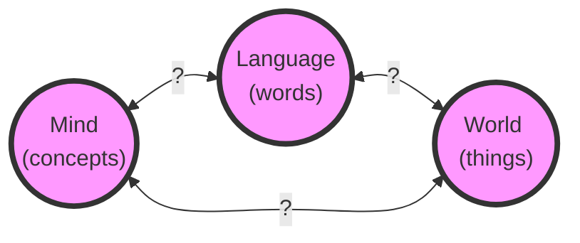

# Nuts and Bolts

## Syllabus and Webpage

[Course Webpage on Canvas](https://canvas.illinoisstate.edu/courses/28259){.source target="_blank" rel="noopener noreferrer"}

-   reading (and commenting), participation, homework, papers, exams
-   grading scheme
-   AI policy

# Why Language?

## Language, Mind, World

## Language and Reality

-   Does language distort our understanding of reality?
    -   '2 + 2 = 4': a truth about mathematical reality, or the product of our
        arbitrary decision to use these symbols in this way?
    -   'Nothing both is and is not': a basic principle governing all things, or
        just a rule of our language?
    -   'Lying is wrong': a moral fact, or a misleading way of expressing your
        feelings about lying?
    -   Substance-accident metaphysics: just a projection of the subject-predicate
        form of language?
-   Does language *shape* reality?
    -   social categories: gender, race, class
    -   binary categorical schemes, negation, contradiction...

## Language and Mind

-   Is language what enables us to think?
-   Do we think *in* a language?
-   Is our ability to think and speak the result of some special magic power
    we have, to access a non-physical realm of meaning and thought?
-   How are you able to understand sentences you've never heard before:
    -   'The purple antelope ate jelly donuts.'

## Language and Communication

-   Language enables communication.
    -   How is it different from other forms of communication?
    -   Communication as sharing *information*: what is happening far away, or in the past, etc.
    -   Communication as sharing *ideas*: how one person reveals their inner world to another.
-   Non-communicative uses of language?
    -   Using language as art (literature, poetry, songs...)
    -   Using language to oppress/control
    -   Using language to include/exclude

## Meanings and Aboutness

-   Meanings are weird:
    -   'a cat' doesn't resemble a cat.
    -   'a unicorn' is about a unicorn, but there are no unicorns.
    -   'a cat' is about a non-specific cat (?) but there are no non-specific
        cats.
-   The picture theory of meaning:
    -   the meaning of 'a cat' is a mental picture of a cat, and the mental
        picture is a picture *of a cat* because it resembles a cat.
    -   But 'a cat' doesn't resemble that mental picture.
    -   And what a picture is a picture of isn't determined by what it resembles:
        -   a bad drawing of a cat does not resemble a cat, but is a drawing of a cat;
        -   a bad drawing of a dog might resemble a cat, but it is of a dog.

## Language and Languages

-   Could there be a perfect language?
    -   Adamic language, Lagadonian language, [Universal
        language](https://www.alamut.com/subj/artiface/language/johnWilkins.html)
    -   Frege, in his *Begriffschrift* ("Concept Script"), attempted to
        construct purely scientific language, stripped of all poetry and
        ambiguity.
-   The value of languages as cultural artifacts?
    -   What would we lose if we replaced the diversity of natural languages
        with a single pure universal language?
    -   What do we lose when languages are lost?
    -   What do colonized people lose when their pre-colonial languages are
        lost?

## Syntax, Semantics, Pragmatics  

-   Syntax: how words relate to other words.
    -   'John is easy to please' ⇒ 'It is easy to please John'
    -   'John is eager to please' ⇏ 'It is eager to please John'
-   Semantics: how words relate to their meanings.
    -   What does the word 'kangaroo' mean? What about the word 'the'?
-   Pragmatics: how words relate to their uses.
    -   Implicature: saying one thing but meaning another
-   Work in *Philosophy of Language* (as opposed to *Linguistics*) tends to
    focus mostly on semantics and pragmatics, and that is what we will do in
    this class.

## Use and Mention

-   A word without quotes is *used*. A word in single quotes is *mentioned*:
    -   Kangaroos have tails.
    -   'Kangaroos' has nine letters.
-   This iterates:
    -   'Kangaroos' is a word that refers to kangaroos.
    -   ‘ ‘Kangaroos’ ’ refers to the word 'kangaroos'.
    -   ‘ ‘ ‘Kangaroos’ ’ ’ refers to ‘ ‘kangaroos’ ’.

## The 'Fido'-Fido theory of meaning

-   A word just means what it stands for.  
-   Troubles:
    -   Phrases, sentences, texts have meaning, not just words. What do they stand for?
    -   *Terms* are words that stand for things, but not every word is a *term*: ‘or,’ ‘of,’ ‘if,’ ‘very,’ etc.
    -   Identity problems: '7 = the square root of 49'; 'Superman = Clark Kent'
    -   Non-referring terms: 'Santa Claus is a jolly old elf'; 'Pegasus is a winged horse'; 'Sherlock Holmes is a detective.'
    -   Negative existentials: 'Santa Claus doesn't exist.'
    -   Attitudes: 'Lois loves Superman'; 'Lois does not love Clark Kent.'

## Next Time: Frege

For next time, you are reading basically one page from Frege's "On sense and
reference". This is an attack on the 'Fido'-Fido theory of meaning. It is
dense! Work through it carefully.

# Discussion

## 'Haddocks' Eyes'

| "The name of the song is called '*Haddocks' Eyes*'."
| "Oh, that's the name of the song, is it?" Alice said, trying to feel interested.
| "No, you don't understand," the Knight said, looking a little vexed.
| "That's what the name is called. The name really is '*The Aged Aged Man*'."
| "Then I ought to have said 'That's what the song is called'?" Alice corrected herself.
| "No, you oughtn't: that's quite another thing! The song is called '*Ways And Means*': but that's only what it's called, you know!"
| "Well, what is the song, then?" said Alice, who was by this time completely bewildered.
| "I was coming to that," the Knight said. "The song really is '*A-sitting On A Gate*': and the tune's my own invention." 

(From Lewis Carroll, *Through the Looking Glass*, ch. 8.)

## Lagadonian Language

Gulliver visits the grand academy at Lagado. One professor is working on
extracting sunbeams from cucumbers, another is working on recreating food out
of human shit, another on building houses from the top down, and so forth.

> We next went to the school of languages, where three professors sat in
> consultation upon improving that of their own country.
>
> The first project was to shorten discourse by cutting polysyllables into
> one, and leaving out verbs and participles, because, in reality, all things
> imaginable are but nouns.
>
> The other project was, a scheme for entirely abolishing all words
> whatsoever; and this was urged as a great advantage in point of health, as
> well as brevity. For it is plain, that every word we speak is, in some
> degree, a diminution of our lungs by corrosion, and, consequently,
> contributes to the shortening of our lives. An expedient was therefore
> offered, "that since words are only names for things, it would be more
> convenient for all men to carry about them such things as were necessary to
> express a particular business they are to discourse on." And this invention
> would certainly have taken place, to the great ease as well as health of the
> subject, if the women, in conjunction with the vulgar and illiterate, had
> not threatened to raise a rebellion unless they might be allowed the liberty
> to speak with their tongues, after the manner of their forefathers; such
> constant irreconcilable enemies to science are the common people. However,
> many of the most learned and wise adhere to the new scheme of expressing
> themselves by things; which has only this inconvenience attending it, that
> if a man's business be very great, and of various kinds, he must be obliged,
> in proportion, to carry a greater bundle of things upon his back, unless he
> can afford one or two strong servants to attend him. I have often beheld two
> of those sages almost sinking under the weight of their packs, like pedlars
> among us, who, when they met in the street, would lay down their loads, open
> their sacks, and hold conversation for an hour together; then put up their
> implements, help each other to resume their burdens, and take their leave.

## The Analytical Language of John Wilkins

-   See handout or open in Perusall.
